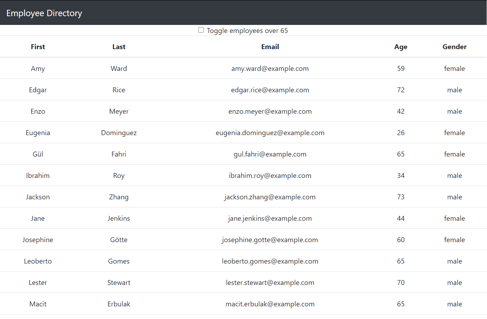

# U-Connect 

## Description:

This Employee Directory is a react app that loads in a random set of 20 users from the random user generator api, and populates a table with the most relevant user data. Some notable features of this app include sorting all columns in ascending and descending order by clicking on the col title,
and dynamically filtering all employees over 65 years of age as per the user's indication.

## Screenshot of App:

## Technology Used:

- HTML
- CSS
- Bootstrap
- Node JS
- react
- Heroku

## Contributors:

- [James Totah ](https://github.com/jtwob)

## Links

- [Live App](https://react-employee-tracker-jtwob.herokuapp.com/)
- [Github Repo](https://github.com/jtwob/React-Employee-Directory)
